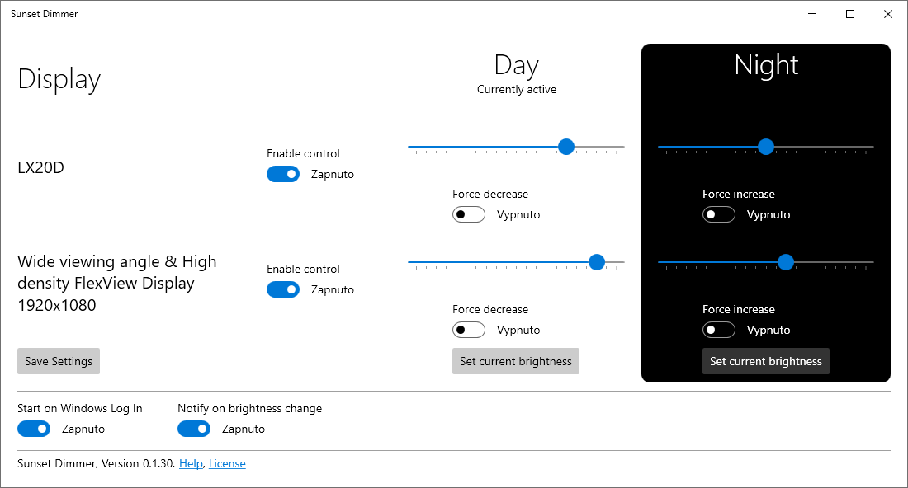

# How does the app work?

Windows 10 and 11 offer a great feature that helps your eyes called [Night light](https://support.microsoft.com/en-us/windows/set-your-display-for-night-time-in-windows-18fe903a-e0a1-8326-4c68-fd23d7aaf136). The Night mode reduces the amount of blue light emitted by the displays.

However, this feature has a significant drawback: it does not change display brightness. In many environments, you need bright displays during the day. But dimming the display for the night is too cumbersome using the display controls or external apps. You have to adjust the settings two times each day constantly.

The Sunset Dimmer takes this responsibility from you. Set up the desired brightness levels once, and the app will take care of the rest. It will automatically dim your displays when sunset comes and increase the brightness when you start working in the morning.

Sunset Dimmer ensures that your eyes have optimal conditions to perform optimally. You automatically watch a nice bright screen during the day to combat sunlight and dimmed screen at night to reduce eye strain.

# Pricing

The app usually costs  $10 / 10€ when purchased from the Microsoft Store.

> Limited offer 50% off

For this price, you get an app that:

- Integrates with the built-in Night Light Windows feature
- Automatically adjusts the display brightness to the time of day
- Installs with no fuss
- Updates automatically
- Comes with a lifetime license

Don't worry. The Microsoft Store provides a free two-week trial version of the app so you can see how beneficial it is to your work comfort and productivity.

Alternatively, you can build the app yourself from the [source code](https://github.com/oookoook/NighttimeDisplayDimmer). However, this method is recommended only for skilled software developers.

# Try the app today!

Don't let poorly set up screens hinder your well-being and productivity! Try the Sunset Dimmer -- the trial is entirely risk-free. Your eyes will thank you!

